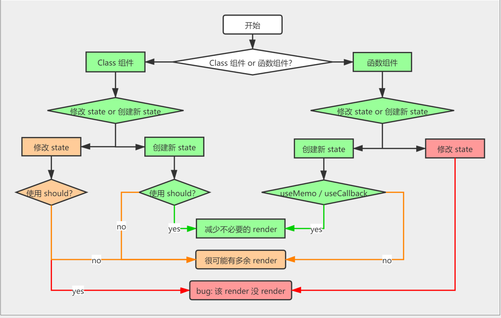

# 单组件状态管理

### 什么叫 state 变了
1. 组件
  - render -> Virtual DOM -> Diff -> 更新真是Dom
  - state -> { count: 1 }
2. 从 1 可以看出, 数据更新, 就是 state 变了

```js
// 示例
state: {count: 1}

运行: state.count += 1

state: {count: 2}

=> render 后

class组件 this.setState(this.state) 不管state变不变, 都调用 render
函数组件 setState(state) state 引用不变, 不调用 render
```

### class 组件修改 state
- `PureComponent 和 shouldComponentUpdate` 作用都是阻止多余的 render
```js
// 假设class 实现 setState 是这样实现的
this.setState = function(newState, fn){
  // 无论是旧引用还是新引用, 都会当成新引用 
  const state = {...newState}
  // 安排 render 调用
}

this.setState(无论是什么) -> 调用 render
```
```js
// demo 里的 新旧 state 是同一个 state, 所以不要修改 state
// 修改 state 会毁掉 PureComponent & shouldComponentUpdate
class App extends React.PureComponent {
  constructor() {
    super();
    this.state = {
      count: 1,
      other: "其他属性"
    };
  }
  onClick = () => {
    // 直接修改state
    this.state.count += 1;
    this.setState(this.state);
  };
  render() {
    console.log("render 执行了");
    return (
      <div>
        {this.state.count}
        <button onClick={this.onClick}>+1</button>
      </div>
    );
  }
}
```

### 函数组件
```js
// 可以认为 setState 代码是这样的
setState = function(newState){
  // 对比新旧 state 是否为同一个 state
  if(newState === state) return;
  // 安排 render 调用
}

==> 流程图是

setState(state) -> state引用变了吗? -> 变了 调用 render, 没变,  什么也不做

不要修改 state, 创建新的 state

newState = { ...state, count: 2}
```

如何让创建 新 state 的代码变简洁?  `immer.js` 这个库创建新对象就像在修改原对象

```js
// 多层嵌套的 state
newState = {...state,   
  user: {...state.user,
    group:{...state.user.group,
      name: 'group 2'
    }
  }
}

==> immer.js

// 代码中的 draft 实际上是个 proxy，会把你的修改收集起来，然后创建新对象 
const newData = produce(data, (draft) => {
  draft.user.group.name = "group 2";
});

```

### class 组件还是 函数组件



### 总结

1. state 内容变了的时候
  - 引用可以不变 `state.user.group.name = 'xxx'`（不推荐）
  - 引用可以变 `state = {...state, user: xxx}`（推荐用 immer）
2. 何时 render*
  - Class 组件看到一个或多个 setState 就 render
  - 函数组件的发现 state 引用变了才会 render
3. render 做了什么
  - render 会创建虚拟 DOM，经过 diff，最后选择性地更新真实 DOM
  - 所以多余的 render 很可能不会浪费多少性能，没必要阻止
  - 拥有阻止 render 的代码如果太复杂，可能比 render 还要耗性能


---

### React 经常使用的组件, 推荐 默认 import

例如 `<TopBar />` 每次 `import TopBar from 'xxxx'`

- 可以使用 污染一个全局变量 `window.app`
- 创建一个 `initial.js` 入口开始就执行
- `initila.js` 里面 `window.app.TopBar = xxx`
