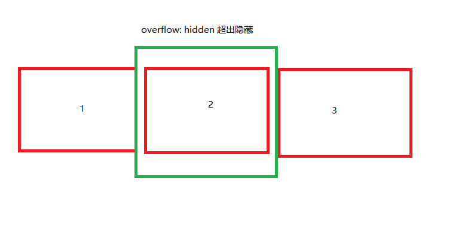

# 无缝轮播 

- `Carousel 旋转木马`

> 下图我们可以看到, 我们放置几个相同的 div, 并排, 中间视图是我们显示的区域, 当我们移动内容的左右距离时, 就可以看到其他的内容, ,显示区设置 `overflow: hidden`, 这个是有缝轮播



```html
div
```


# 无缝轮播 
- 使用 `react` 组件的功能, 添加对应 css

- 动画停止的原理, 把计时器关掉, 创建 state: timerId = null, 每次 timerId =  setTimeout, 关闭时 clearTimeout,
- `onmouseleave`时, 再次运行动画, 判断 timerId 是否存在, 存在, return 


- 移动端 touch 事件: `touchstart touchmove touchend` e.touches 是 数组, 多点触控, 比较开始和结束时, touches 的 `clientX clientY` 的差值


### 动画
1. 把所有的`item` 全部放在 视图里, 绝对定位, 然后开始时把元素放在右边准备动画, 但是这样 脱离文档流, 元素会坍塌了
2. 对于元素坍塌, 我们怎么解决?
  - 我们把离开的元素 让它绝对定位,

3. 上一次的 index, 就是 选中的 select,  这一次使我们点击后的 index
